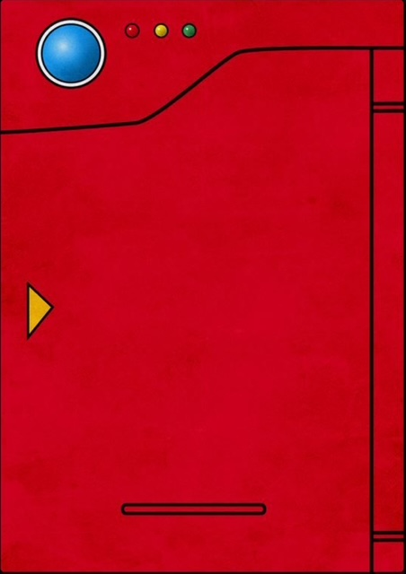

# 🕹️ Pokédex

A simple Pokédex built with **HTML**, **CSS**, and **JavaScript** that allows you to search for Pokémon by name or number, and navigate between them using the "Prev" and "Next" buttons. The app consumes data from [PokeAPI](https://pokeapi.co/) 🐱‍👤.

---

## 🚀 Features

- 🔍 Search Pokémon by name or number.
- ⏮️ Navigate to the previous Pokémon.
- ⏭️ Navigate to the next Pokémon.
- 🖼️ Display animated Pokémon sprites (generation 5).
- 🎨 Stylish design inspired by the real Pokédex.
- 🔄 Open and close the Pokédex by clicking the image, with state saved in `localStorage` 🗃️.

---

## 📋 How to use

1. Open the project in your favorite browser 🌐.
2. Use the search bar to type the Pokémon name or number 🐉.
3. Click the "Prev" and "Next" buttons to navigate through Pokémon.
4. Click the closed Pokédex image to open and see details 📖.
5. Click the open Pokédex image to close it, hiding the details 🕶️.

---

## 🛠️ Technologies used

- HTML5
- CSS3 (with custom font and responsiveness)
- JavaScript (Fetch API + DOM)
- [PokeAPI](https://pokeapi.co/) for Pokémon data

---

## 🗂️ Project structure

- `index.html` — Pokédex layout structure
- `/assets/css/styles.css` — Project styles
- `/assets/js/script.js` — Application logic

---

## ✨ Improvements made

During development, I missed having the ability to **open and close the Pokédex** for a better visual experience.

So, I implemented:

- 🔄 Toggle to open/close the Pokédex by clicking the image.
- 💾 State saved in `localStorage` to remember your choice.
- 🙈 Pokémon content is hidden when the Pokédex is closed.

---

## 📸 Demo

  
*Pokédex open showing the Pokémon*

  
*Pokédex closed*

---

## 📄 License

Project inspired by DIO.me as part of the Santander Bootcamp 2025 💻. Inspiration by @manualdodev.

---

## PORTUGUÊS

# 🕹️ Pokédex

Uma Pokédex simples feita com **HTML**, **CSS** e **JavaScript** que permite buscar Pokémon por nome ou número, e navegar entre eles com os botões "Prev" e "Next". A aplicação consome dados da [PokeAPI](https://pokeapi.co/) 🐱‍👤.

---

## 🚀 Funcionalidades

- 🔍 Buscar Pokémon pelo nome ou número.
- ⏮️ Navegar para o Pokémon anterior.
- ⏭️ Navegar para o próximo Pokémon.
- 🖼️ Exibir a imagem animada do Pokémon (sprites da geração 5).
- 🎨 Design estilizado inspirado na Pokédex real.
- 🔄 Abrir e fechar a Pokédex clicando na imagem, com estado salvo no `localStorage` 🗃️.

---

## 📋 Como usar

1. Abra o projeto no seu navegador favorito 🌐.
2. Use a barra de busca para digitar o nome ou número do Pokémon 🐉.
3. Clique nos botões "Prev" e "Next" para navegar pelos Pokémons.
4. Clique na Pokédex fechada para abrir e ver os detalhes 📖.
5. Clique na Pokédex aberta para fechá-la, escondendo os detalhes 🕶️.

---

## 🛠️ Tecnologias usadas

- HTML5
- CSS3 (com fonte customizada e responsividade)
- JavaScript (Fetch API + DOM)
- [PokeAPI](https://pokeapi.co/) para dados dos Pokémons

---

## 🗂️ Estrutura do projeto

- `index.html` — Estrutura do layout da Pokédex
- `/assets/css/styles.css` — Estilos do projeto
- `/assets/js/script.js` — Lógica da aplicação

---

## ✨ Melhorias feitas

Durante o desenvolvimento, senti falta de poder **abrir e fechar a Pokédex** para uma melhor experiência visual. 

Por isso, implementei:

- 🔄 Toggle para abrir/fechar a Pokédex clicando na imagem.
- 💾 Estado salvo no `localStorage` para lembrar sua escolha.
- 🙈 Conteúdo do Pokémon escondido quando a Pokédex está fechada.

---

## 📸 Demonstração

  
*Pokédex aberta mostrando o Pokémon*

  
*Pokédex fechada*

---

## 📄 Licença

Projeto idealizado pela DIO.me como parte do Bootcamp Santander 2025 💻. Com inspiracao do @manualdodev

---

